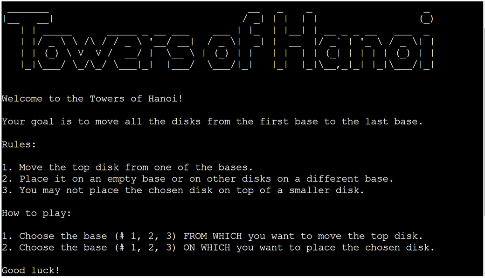
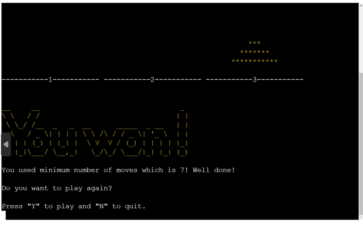

# Tower of Hanoi

Towers of Hanoi is a Python command line interface (CLI) application which allows the user to play a well-know game of <a href="https://en.wikipedia.org/wiki/Tower_of_Hanoi" target="_blank" rel="noopener">Tower of Hanoi</a>. The user has an option to choose the difficulty level. The easy level can be played in a minute, the more difficult levels will take some time, but will help the user develop and improve their logical thinking. 

This game can be played both by adults and children. In fact, the inspiration for replicating this game for my project came from seeing my daughter enjoy playing this game.

You can play the Towers of Hanoi here:
[Towers of Hanoi](https://towers-of-hanoi-game.herokuapp.com/)

[Back to top](#contents)

# Contents

- [Tower of Hanoi](#tower-of-hanoi)
- [Contents](#contents)
- [User Experience (UX)](#user-experience-ux)
  - [User Stories](#user-stories)
    - [Primary Goal](#primary-goal)
    - [Visitor Goals](#visitor-goals)
      - [First Time Visitor](#first-time-visitor)
      - [Returning Visitor](#returning-visitor)
      - [Frequent Visitor](#frequent-visitor)
  - [Creation Process](#creation-process)
    - [Planning](#planning)
      - [Dependency diagram](#dependency-diagram)
    - [App Structure](#app-structure)
    - [Python Logic](#python-logic)
  - [Design Choices](#design-choices)
    - [Typography](#typography)
    - [Color Scheme](#color-scheme)
- [Features](#features)
    - [ASCII Art](#ascii-art)
    - [Welcome message](#welcome-message)
    - [Slow Print](#slow-print)
    - [Difficulty Level](#difficulty-level)
    - [Mechanism of the Game](#mechanism-of-the-game)
    - [Scores](#scores)
    - [Winning message](#winning-message)
    - [Future Features](#future-features)
- [Technologies Used](#technologies-used)
- [Python Packages](#python-packages)
- [Testing](#testing)
    - [Manual testing](#manual-testing)
    - [External Testing](#external-testing)
      - [Python Validation](#python-validation)
- [Deployment](#deployment)
  - [Project Deployment](#project-deployment)
  - [To fork the repository on GitHub](#to-fork-the-repository-on-github)
  - [To create a local clone of a project](#to-create-a-local-clone-of-a-project)
- [Credits](#credits)
  - [Content](#content)
  - [Media](#media)
  - [Acknowledgements](#acknowledgements)

[Back to top](#contents)
# User Experience (UX)

## User Stories

### Primary Goal

The primary goal of this CLI application is to provide a simple game for children and adults to help them develop critical logical skills, but at the same time to teach them patience and perseverence, especially when playing the more difficult levels.

### Visitor Goals
Towers of Hanoi game has been designed to be straightforward, with minimalist design due to using CLI. The current version is aimed at people who enjoy puzzles and challenges so they can put their logical skills to test. The user can choose a level of difficulty and can challenge themselves the beat the minimum number of moves needed.

#### First Time Visitor
  - A user can find the game rules on the opening screen.
  - A user can start the game by pressing the Run Program button.
  - A user can choose the level of difficilty by indicating a number of disks they want to play with.
  - A user can expect the number of moves to be displayed in the winning modal window.
  - A user can choose to Play again after they have won or lost, or choose to leave the game.
  - A user can compare their number of moves with the minimum number of moves needed.
#### Returning Visitor
  - A user is familiar with the rules and can start the game by clicking the Run button.
  - A user can choose the level of difficulty. The more disks they choose, the more difficult the game.

#### Frequent Visitor
  - A user can try to use the minimum number of moves which in 2**n - 1.

[Back to top](#contents)
## Creation Process

### Planning

Before I started working on the actual application, I created a flow chart which helped me organize dependencies and provided me with a blueprint to follow when developing the app. This was extremely useful especially in moments, when it was not clear were a certain function or a feature belonged, what the dependencies were or with what should be tackled next. I tried to break each step into a managable bite-size function so the code would be easy to read and understand. I started by figuring out the dimensions of my disks and the number of disks I would be able to use for choosing difficulty levels, then I focused on being able to move the disks from one base to another. At first I was printing the pyramids below each other, but later changed the layout to parallel for better readability. Towards the end of the development process, I started adding some nice-to-have features, like clearning the screen for less messy output or shortening and rephrasing the rules and prompts for better comprehension.

I used Projects tool inbuilt in GitHub to help me track my progress and bugs, but also to jot down any ideas that were relevant for the game development. These ideas were either later applied in the code or dismissed if they did not seem to enhance the user experience or improve the development process.

This time I did not create any wireframes, as the application is rather simple in layout and is mainly intended to be played on the desktop. 

My main goal was for the content to fit within the restricted size of the window. The width of the window also predetermined the highest level of difficulty, as the largest disks needed to fit three times next to each other on the screen of 80 characters.

Requirements for the game:
  - The game will use simple and clear representation of the towers of Hanoi.
  - The screen will be cleared periodically, so the user is not overwhelmed or confussed by a large number of print statements.
  - The user will be able to choose the level of difficulty.
  - The game will show the scores in the winning modal.
  - The user will have a choice to play again or stop playing the game.
  
[Back to top](#contents) -->

#### Dependency diagram

### App Structure
The app structure is very simple as it is a CLI application and its dimensions are restricted by the display window of 80 characters per line on max 24 lines.

### Python Logic
  The logic of the game itself is not very difficult: Move the disks from the first base to the last base. The main restriction is that the user may not place a bigger disk on a smaller one. The game can become quite long if the user is just randomly moving the disks and is not trying to use the minimum number of moves.

  This is the original flow chart where I broke the program into managable clear steps. 

  I had to frequently validate the user input to make sure, that the correct type of input was returned (either string or a number). In case of a number input I had to check if the number was within the required range. Anytime the user does not provide the correct input, they are informed about their mistake and asked to correct their choice.

  I used (Object oriented programming) OOP in some parts of the application for better manipulation with the objects.

[Back to top](#contents)

## Design Choices

I have tried to keep the game design very simple and easily legible. I did use ASCII art to make the welcome screen a bit more interesting.

### Typography

I have not altered the type of script, as the original one is well suited for this game. 

### Color Scheme
<!-- - I have used yellow and red colors to alert the user of a mistake which needs correcting, but otherwise I have kept the interface in black and white. -->

[Back to top](#contents)

# Features
### ASCII Art

<!--  -->

I have used the ASCII Art to make the welcome page more interesting.

### Welcome message

<!--  -->

As soon as the page is loaded, the ASCII Art is displayed and a welcome message is gradually printed out. In the welcome message the rules and a warning are explained. 
### Slow Print

The welcome message and the rules are printed slowly so the user is not overwhelmed by the long text they would have to read when opening the app. The first few user options are displayed with a slight delay so the user has time to make a choice.

[Back to top](#contents)

### Difficulty Level

[Back to top](#contents)
### Mechanism of the Game

[Back to top](#contents)
### Scores

Each time the user moves a disk from one stack/pyramid to another, the number of moves is increased. The moves are displayed when the user has accomplished moving all the disks from the first base to the third base.

[Back to top](#contents)

### Winning message

When the user manages to move all the disks from the 1st base to the last one, they are informed of successfully finishing the game. 

Within the winning message, the user is informed of the number of moves they used. This number is compared to the minimum number of moves which is 2**n -1. This can motivate the user to decrease the number of moves they use next time, or the user is congratulated on the use of minimum number of moves if that's what they achieved.

At the end, the user gets a choice to play again or to quit the game. 

When the user chooses the Play again option, the game is reset to the intial settings and the user can newly choose the level of difficulty.

[Back to top](#contents)

### Future Features
- I would like to improve the visualization of the disk being moved for the user to clearly see the moved disk. This is mainly because of a confusing situation when the user is trying to move a disk which is bigger than top disks on the other stacks and thus has to return the disk to its original position.

- In the future, I could also implement the user name usage and score tracking functionality.

[Back to top](#contents)

## Reminders

* Your code must be placed in the `run.py` file
* Your dependencies must be placed in the `requirements.txt` file
* Do not edit any of the other files or your code may not deploy properly

## Creating the Heroku app

When you create the app, you will need to add two buildpacks from the _Settings_ tab. The ordering is as follows:

1. `heroku/python`
2. `heroku/nodejs`

You must then create a _Config Var_ called `PORT`. Set this to `8000`

If you have credentials, such as in the Love Sandwiches project, you must create another _Config Var_ called `CREDS` and paste the JSON into the value field.

Connect your GitHub repository and deploy as normal.

## Constraints

The deployment terminal is set to 80 columns by 24 rows. That means that each line of text needs to be 80 characters or less otherwise it will be wrapped onto a second line.

-----
Happy coding!