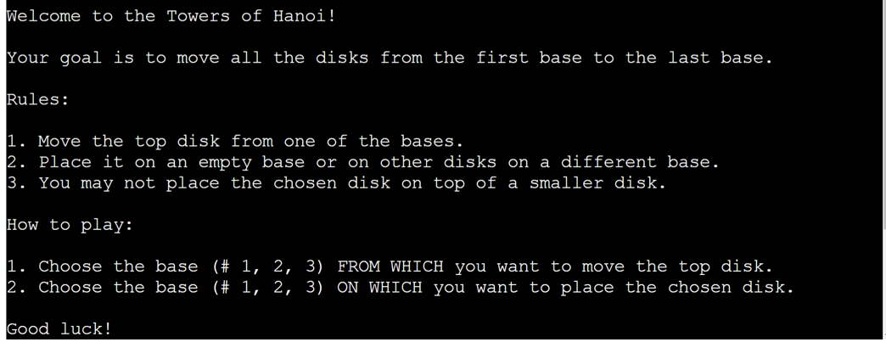
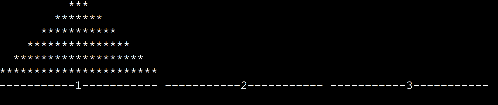

# Tower of Hanoi

Towers of Hanoi is a Python command line interface (CLI) application which allows the user to play a well-know game of <a href="https://en.wikipedia.org/wiki/Tower_of_Hanoi" target="_blank" rel="noopener">Tower of Hanoi</a>. The user has an option to choose the difficulty level. The easy level can be played in a minute, the more difficult levels will take some time, but will help the user develop and improve their logical thinking. 

This game can be played both by adults and children. In fact, the inspiration for replicating this game for my project came from seeing my daughter enjoy playing this game.

You can play the Towers of Hanoi here:
[Towers of Hanoi](https://towers-of-hanoi-game.herokuapp.com/)

<!-- 
  -->

[Back to top](#contents)

# Contents

- [Tower of Hanoi](#tower-of-hanoi)
- [Contents](#contents)
- [User Experience (UX)](#user-experience-ux)
  - [User Stories](#user-stories)
    - [Primary Goal](#primary-goal)
    - [Visitor Goals](#visitor-goals)
      - [First Time Visitor](#first-time-visitor)
      - [Returning Visitor](#returning-visitor)
      - [Frequent Visitor](#frequent-visitor)
  - [Creation Process](#creation-process)
    - [Planning](#planning)
      - [Projects Tool](#projects-tool)
      - [Dependency diagram](#dependency-diagram)
    - [App Structure](#app-structure)
    - [Python Logic](#python-logic)
  - [Design Choices](#design-choices)
    - [Typography](#typography)
    - [Color Scheme](#color-scheme)
- [Features](#features)
    - [ASCII Art](#ascii-art)
    - [Welcome message](#welcome-message)
    - [Slow Print](#slow-print)
    - [Difficulty Level](#difficulty-level)
    - [Intial Picture](#intial-picture)
    - [Mechanism of the Game](#mechanism-of-the-game)
      - [ad 1) FROM BASE](#ad-1-from-base)
      - [ad 2) TO BASE](#ad-2-to-base)
    - [Scores](#scores)
    - [Winning message](#winning-message)
    - [Future Features](#future-features)
- [Technologies Used](#technologies-used)
- [Python Packages](#python-packages)
- [Python Libraries](#python-libraries)
- [Testing](#testing)
- [Deployment](#deployment)
  - [Project Deployment](#project-deployment)
  - [To fork the repository on GitHub](#to-fork-the-repository-on-github)
  - [To create a local clone of a project](#to-create-a-local-clone-of-a-project)
- [Credits](#credits)
  - [Content](#content)
  - [Media](#media)
  - [Acknowledgements](#acknowledgements)

[Back to top](#contents)
# User Experience (UX)

## User Stories

### Primary Goal

The primary goal of this CLI application is to provide a simple game for children and adults to help them develop critical logical skills, but at the same time to teach them patience and perseverence, especially when playing the more difficult levels.

### Visitor Goals
Towers of Hanoi game has been designed to be straightforward, with minimalist design due to using CLI. The current version is aimed at people who enjoy puzzles and challenges so they can put their logical skills to test. The user can choose a level of difficulty and can challenge themselves the beat the minimum number of moves needed.

#### First Time Visitor
  - A user can find the game rules on the opening screen.
  - A user can

I tried to break each step into a managable bite-size function so the code would be easy to read and understand. I started by figuring out the dimensions of my disks and the maximum number of disks the user would be able to use for choosing difficulty levels. Afterwards, I focused on being able to move the disks from one base to another. At first I was printing the pyramids below each other for simplicity, but later I changed the layout to parallel for better readability and to go back to the original layout. Towards the end of the development process, I started adding some nice-to-have features, like clearing the screen for a less messy output or shortening and rephrasing the rules and prompts for better comprehension. As I went, I refactored the code wherever possible to make it easily comprehensible.

For this project, I did not create any wireframes, as the application is rather simple in layout and is mainly intended to be played on the desktop. But, I was inspired by this [picture](readme-images/tower-of-hanoi.png) and this [version in terminal](/readme-images/towers_of_hanoi_terminal.gif).

My main goal was for the content to fit within the restricted size of the window. The width of the window also predetermined the highest level of difficulty, as the largest disks needed to fit three times next to each other on the screen of 80 characters. I used the clear function to keep the CLI neat and easily readable.

Requirements for the game:
  - The game will use simple and clear representation of the towers of Hanoi. start the game by pressing the Run Program button.
  - A user can choose the level of difficilty by indicating a number of disks they want to play with.
  - A user can expect the number of moves to be displayed in the winning message.
  - A user can expect a visual feedback for warnings, but also for winning the game.
  - A user can choose to Play again after they have won or lost, or choose to leave the game.
  - A user can compare their number of moves with the minimum number of moves needed.
#### Returning Visitor
  - A user is familiar with the rules and can start the game by clicking the Run button.
  - A user can choose the level of difficulty. The more disks they choose, the more difficult the game.

#### Frequent Visitor
  - A user can try to use the minimum number of moves which according to [Wikipeadia](https://en.wikipedia.org/wiki/Tower_of_Hanoi) is 2**n - 1.

[Back to top](#contents)
## Creation Process

### Planning

Before I started working on the actual application, I created a flow chart which helped me organize dependencies and provided me with a blueprint to follow when developing the app. This was extremely useful especially in moments, when it was not clear were a certain function or a feature belonged, what the dependencies were or with what should be tackled next. 
  - The user will be able to choose the level of difficulty.
  - The screen will be cleared periodically, so the user is not overwhelmed or confussed by a large number of print statements.
  - The game will show the scores in the winning message and compare them to minimum required moves.
  - The user will have a choice to play again or stop playing the game.
  
[Back to top](#contents) -->

#### Projects Tool

I used Projects tool inbuilt in GitHub, [GitHub's Projects](https://github.com/lucia2007?tab=projects), to help me manage the scope of the project, to track my progress and record bugs, but also to jot down any ideas that were relevant for the application development. These ideas were either later applied in the code or dismissed if they did not seem to enhance the user experience or improve the development process.

Whenever I had an idea related to the project, I would jot it down in the "To Do" section. Later, I would choose 2, max 3 things that were currently being worked on and I placed them in the "In Progress" section. If I became stuck on a task for whatever reason or depended on external input, I moved it to "Blocked". At last, when a task was completed, I would move it to the "Done" section.

This tool has been very benefitial for my development process, especially, because I could rely on having all the information here. I would write down the sources to be credited, or bugs to be fixed or ideas on how to improve some part of the application so I did not have to worry about having forgotten something crucial. 

In the future, for a bigger project, I would focus on a more detailed description of messages and adding next steps or a deadline for each of the entries.
#### Dependency diagram

  This is the original flow chart where I broke the program into managable clear steps. 
  <!-- add a picture of the flow chart -->

### App Structure
The app structure is very simple and uniform as it is a CLI application and its dimensions are restricted by the display window of 80 characters per line on max 24 lines.

### Python Logic
  The logic of the game itself is not very difficult: The goal is to move all the disks from the first base to the last base. The main restriction is that the user may not place a bigger disk on a smaller one. The game can become quite long and tedius if the user is just randomly moving the disks and is not trying to optimize the number of moves. On the other hand, it can be quite motivating to try to achieve the minumum number of moves.

  I had to frequently manually validate the user input to make sure, that the correct type of input was returned. In case of a number input I had to check if the number if a number was entered and if it was within the required range. For a string, I had to check if the correct string was returned. 
  
  Anytime the user does not provide the correct input, they are informed about their mistake and asked to correct their choice. All warning messages are displayed in red, so the user is alerted about the mistake. I also had to check for logical catches like preventing the user from taking a disk from an empty pyramid, or placing a bigger disk on a smaller one.

  I used (Object oriented programming) OOP in some parts of the application for better manipulation with the objects. This proved helpful especially when moving the disks from one stack to the other, or for drawing the pyramids.

[Back to top](#contents)

## Design Choices

I have tried to keep the game design very simple and easily legible. I did use ASCII art to make the welcome screen a bit more interesting. I also used the ASCII Art to inform the user of their win. 

### Typography

I have not altered the type of script, as the original one is well suited for this app. 

### Color Scheme

As regards color scheme, I mostly went along with the original setting, but I did install [Colorama](https://pypi.org/project/colorama/) in order to be able to use red color of font for warnings and yellow color for the winning display.

[Back to top](#contents)

# Features
### ASCII Art

I choose to use ASCII Art on the welcome page to improve the user experience and to get the user interested.

### Welcome message

As soon as the page is loaded, the ASCII Art is displayed and a welcome message is gradually printed out. In the welcome message the rules and mechanism of the game are explained. 
### Slow Print

The welcome message and the rules are printed slowly so the user is not overwhelmed by the long text they would have to read when opening the app. 

The first few user options are displayed with a slight delay so the user has time to make a choice.

[Back to top](#contents)

### Difficulty Level

After the welcome message, the user is promted to choose a number of disks they want to play with. The more disks the user chooses, the more difficult and longer the game.

The user is expected to enter a number between 3 and 6. If they choose a number smaller or bigger than the given range, they are informed of their mistake and prompted to choose a number from the indicated range. Also, they are alerted if they choose a string instead of a number.

### Intial Picture

After the user chooses a number of disks, a "playground" with the correct number of disks is displayed.

[Back to top](#contents)
### Mechanism of the Game
A move consists of two steps:
1. The user has to choose FROM WHICH base they want to take the top disk.
2. The user has to indicate ON WHICH base they want to place the chosen disk.

#### ad 1) FROM BASE

The user must indicate from which base he wants to move the disk. They may not take a disk from an empty base. They must choose a number between 1 and 3. If a mistake is made, the user is alerted by a message printed in red and they are prompted to correct their choice.

#### ad 2) TO BASE

The user must indicate on which base he wants to place the disk. They must choose a number between 1 and 3. If a mistake is made, the user is alerted by a message printed in red and they are prompted to correct their choice. They may not place a disk on a base where is top disk is smaller than the chosen one.

[Back to top](#contents)
### Scores

Each time the user moves a disk from one stack/pyramid to another, the number of moves is increased. The moves are displayed when the user has accomplished moving all the disks from the first base to the third base.

[Back to top](#contents)

### Winning message

When the user manages to move all the disks from the 1st base to the last one, they are informed of successfully finishing the game. 

Within the winning message, the user is informed of the number of moves they used. This number is compared to the minimum number of moves which is 2**n -1. This can motivate the user to decrease the number of moves they use next time, or the user is congratulated on the use of minimum number of moves if that's what they achieved.

At the end, the user gets a choice to play again or to quit the game. 

When the user chooses the Play again option, the game is reset to the intial settings and the user can newly choose the level of difficulty.

[Back to top](#contents)

### Future Features
- I would like to improve the visualization of the disk being moved for the user to clearly see the moved disk. This is mainly because of a confusing situation when the user is trying to move a disk which is bigger than top disks on the other stacks and thus has to return the disk to its original position.

- In the future, I could also implement the user name usage and score tracking functionality.

[Back to top](#contents)

# Technologies Used
- [Github](https://github.com/) - used for hosting the repository
- [Heroku](https://heroku.com/) - used for deploying the application
- [Gitpod](https://www.gitpod.io/#get-started) - used for developing the application
- [LucidChart](https://www.lucidchart.com) - used for creating the flow chart

[Back to top](#contents)

# Python Packages

# Python Libraries

# Testing

For testing the application, I used manual testing and an external validators. Both manual and external testing are a part of a separate testing [file](/TESTING.md).

* Your code must be placed in the `run.py` file
* Your dependencies must be placed in the `requirements.txt` file
* Do not edit any of the other files or your code may not deploy properly

## Creating the Heroku app

## Media
- [Towers of Hanoi illustrative picture](https://www.geeksforgeeks.org/c-program-for-tower-of-hanoi/)

1. `heroku/python`
2. `heroku/nodejs`

## Acknowledgements
- Extra help and guidance was received from my mentor Precious Ijege, from my husband Sam and fellow colleagues from the Code Institute.
- My husband Sam encouraged me to use OOP and guided me through it. He also encouraged me to use annotation for functions which helped me during the debugging process.
- Other sources of inspiration and help:
https://www.geeksforgeeks.org/c-program-for-tower-of-hanoi/
https://www.geeksforgeeks.org/clear-screen-python/
https://pythonexamples.org/python-convert-range-into-a-list/
https://stackoverflow.com/questions/15375368/slow-word-by-word-terminal-printing-in-python
https://www.freecodecamp.org/news/the-python-sleep-function-how-to-make-python-wait-a-few-seconds-before-continuing-with-example-commands/#:~:text=You%20can%20use%20Python's%20sleep,pauses%20between%20words%20or%20graphics.
https://www.freecodecamp.org/news/python-do-while-loop-example/

Thank you all for your support and encouragement. I couldn't have done it without you.

[Back to top](#contents)

## Constraints

The deployment terminal is set to 80 columns by 24 rows. That means that each line of text needs to be 80 characters or less otherwise it will be wrapped onto a second line.

-----
Happy coding!